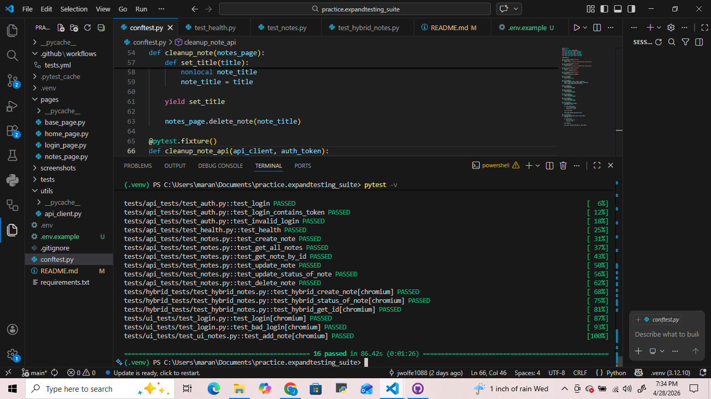

# Practice.expandtesting - Hybrid UI + API Test Suite

Self-built hybrid UI + API automation suite for the [Notes/app](https://practice.expandtesting.com/notes/app) application using **Python, pytest, Playwright (UI)**, and **requests (API)**.

Built as part of my self-training for **Junior QA Automation Engineer** roles while transitioning from running a small business.

## About This Project

This suite demonstrates reliable hybrid testing:
- **API layer**: Authentication, full CRUD on notes (create, retrieve, update,delete), negative cases (invalid credentials), health checks and cleanup after tests.
- **UI layer**: Complete user flow — login, create note (title, description, category), negative cases with cleanup after each tests that creates a note.
- Tests are designed to be re-runnable without manual data cleanup.

## Technologies Used

- **Python 3.12**
- **pytest** (test framework + fixtures)
- **Playwright** (browser automation)
- **requests** (API testing)
- **GitHub Actions** (CI/CD)

## Key Features & What I Learned

- **Page Object Model (POM)** for clean separation of page logic and tests on UI side.
- **api_client** for clean separation of request logic and tests on the API side.
- Reusable **pytest fixtures** in `conftest.py` to reduce duplication.
- Integration of UI and API tests in one unified framework.
- Robust locators (e.g., `get_by_test_id`, `get_by_role`)
- Automated CI pipeline that runs the full suite on every push

## Project Structure
```
practice.expandtesting_suite/
├── .github/workflows/      # GitHub Actions CI
│    └── tests.yml
├── pages/
│   ├── base_page.py     # POM implementation
│   ├── home_page.py
│   ├── login_page.py
│   └── notes_page.py
├── screenshots/
│    └── all_tests_passing.png
├── tests/
│   ├── api_tests/
│   │   ├── test_auth.py
│   │   ├── test_health.py
│   │   └── test_notes.py
│   ├── hybrid_tests/
│   │   └── test_hybrid_notes.py
│   └── ui_tests/
│       ├── test_login.py
│       └── test_ui_notes.py
├── utils/
│   └── api_client.py  
├── .env.example
├── conftest.py
├── README.md
└── requirements.txt
```

## Test Results



## Setup & Running Tests

1. Clone the repository
2. Create and activate a virtual environment:
```bash
python -m venv .venv
# Windows: .venv\Scripts\activate
# Mac/Linux: source venv/bin/activate
```
3. Install dependencies:
```bash
pip install -r requirements.txt
playwright install
```
4. Create a `.env` file in the root directory:
```
EMAIL=your_email
PASSWORD=your_password
```

5. Run tests:
```bash
# All tests
pytest

# Verbose + stop on first failure
pytest -v -x

# Specific file
pytest tests/ui_tests
```

## CI/CD

GitHub Actions workflow automatically runs the full test suite in headless mode on every push.

## Why This Matters for QA Roles

This project shows I can build maintainable, production-like automation that combines UI and API testing — skills directly applicable to real-world test frameworks.